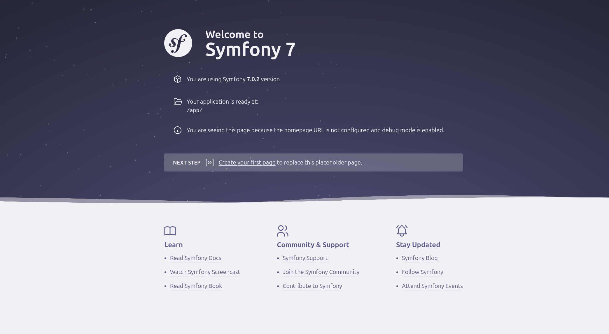

# PHP Frameworks - Wolfi Demo

This repository contains a demo Docker setup for Laravel and Symfony applications, using the following developer images from Chainguard:

- cgr.dev/chainguard/php:latest-fpm-dev
- cgr.dev/chainguard/nginx:latest-dev
- cgr.dev/chainguard/mariadb:latest-dev

**The included Dockerfile does not build the application. You still need to run Composer locally. The Docker Compose setup will create a volume share with the application files.**

## Laravel Demo

```shell
cd demo-laravel
composer install
docker compose up
```
Then visit https://localhost:8000 in your browser to access the application.


## Symfony Demo
```shell
cd demo-symfony
composer install
docker compose up
```
Then visit https://localhost:8000 in your browser to access the application.

